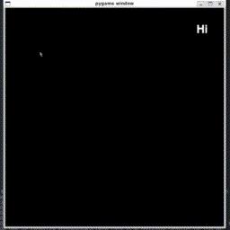

# Dymnist
## Dynamic app to identify user-written digits

## Dependencies
- Python 3
- Tensorflow (Keras)
- Pygame
- Numpy

## Usage
Run  
`python3 dymnist.py`

Commands:
- `mouse left button` Draw
- `mouse right button` Erase
- `enter` Guess
- `spacebar` Clean screen